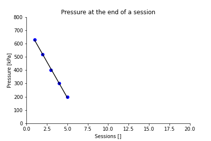

# Temporal Summation and Conditioned Pain Modulation Protocol (Compressor Test Version)

# Introduction

This protocol is intended as a protocol to determine the required air supply for the [Temporal summation and Conditioned Pain Modulation protocol](https://github.com/LabBench-Society/Protocols/tree/main/repository/CTSCPM) (```ctscpm@labbench.io```) and **NOT** as a protocol for actual experiments. With this protocol, you can determine if a given air supply system, such as a compressor or diving bottle, holds sufficient air for the number of consecutive sessions you plan to perform in your study.

This protocol contains the same cuff pressure algometry tests as the ```ctscpm@labbench.io``` protocol, with an additional survey test at the end of the protocol. This survey test allows you to enter the remaining air supply pressure at the end of the protocol. In this protocol, autostart is enabled. All tests will run automatically when you click start in the LabBench Start-up Wizard. 

The idea in the protocol is to repeat the protocol in consecutive sessions until the protocol fails because the air supply pressure falls below the minimal air supply pressure of 200kPa that the CPAR+ device requires to operate. 

This test assumes that the air tank is fully pressurised and the compressor is turned off to prevent unwanted noise during an experiment. The air tank must hold sufficient pressure for an entire workday or a session, depending on whether the air tank can be repressurised after each session.

## Methods and materials

### Experimental setup

The experimental setup consists of:

1. The Compressor (Device Under Test)
2. A computer that is running the LabBench and the ```ctscpmauto@labbench.io``` protocol
3. A LabBench CPAR+ DUO device
4. Two Surgical Tourniquet Cuffs (In the present test: VBM Tourniquet Cuffs (REF 20-54-522))
5. A LabBench SCALE (not shown in figure 1)

For an overview of the experimental setup, please see Figur 1.


*Figure 1: Experimental setup for testing if a compressor or similar air supply system (Device Under Test) has a sufficient air supply for an experimental protocol.*

To set up the equipment for testing the compressor:

1. Install the "Temporal Summation and Conditioned Pain Modulation Protocol (Compressor Test Version)" (```ctscpmauto@labbench.io```) protocol on the LabBench computer (please see Figure 2)
2. Connect the computer with the USB cable to the CPAR+ DUO device.
3. Connect the air pressure hose from the compressor to the CPAR+ Due device.
4. Connect the LabBench SCALE device to the Response Port of the CPAR+ Due device. Set the slider to a rating of zero.
5. Connect to cuffs to Outlets 1 and 2 on the CPAR+ DUO device. These cuffs are wrapped around water-filled plastic bottles with a circumference similar to the limb being tested in the actual experiment. Their water level is set, so the softness of the bottle approximates the softness of the limb being tested.

Please see Figure 2 for how to install the test protocol in LabBench.


*Figure 2: Setup of LabBench for the compressor test. Installation of the "Temporal Summation and Conditioned Pain Modulation Protocol (Compressor Test Version)" protocol.*

**Important Note:** Place the water-filled bottles in a bucket for the safety of your laboratory. Ideally, it should be possible to cover the buckets, as a water geyser may erupt if the bottles cannot withstand the pressure. Alternatively, turn the bottles upside down, which in case of bottle failure, will direct the water geyser into the bucket. However, in that case, secure the bottles to the bucket, so they do not risk flying through the air. We have made these mistakes at Inventors' Way, so you don't have to.


### Protocol

To perform the test:
1. Turn on the compressor and repressurise its air tank to its maximum pressure.
2. Until the protocol fails, run this protocol consecutively by:
   1. Start LabBench and go through its Startup Wizard. In the Session Step, name the session after the run number (i.e. SES01, SES02, etc.). 
   2. At the end of the Startup Wizard, when you press "Start", the CPAR+ DUO device will automatically start the first cuff pressure algometry test, and it will continue until all the tests have been completed. Let it complete all tests without stopping them manually.
   3. When all the cuff pressure algometry tests in the protocol have been completed, read the air pressure in the air tank and enter it in the Survey test that is now active and finish the survey test.
   4. Close LabBench Runner, restart it and rerun the protocol until it fails because of too low air supply pressure. 

### Data analysis

A python script [```analysis.py```](analysis.py) is available for this protocol and is listed below. This script will analyse the protocol results by performing a linear regression analysis and plotting the data from the test.

The maximum number of sessions is determined from the regression line as the last session for which the remaining pressure in the air tank was higher than 200kPa. The script also provides the average pressure drop per session from the slope of the regression line.

To use the script, export the data from the test from LabBench as a JSON file. Data from the test is exported in the LabBench Designer under the Experiments page.

In the [```analysis.py```](analysis.py) change the filename to the name of the file you exported from LabBench Designer. For the analysis to be correct, you must also change the conversion factor so the pressure values will be in kPa.

When you run the script, it will produce a PNG file with the data plot and write the maximum number of sessions and average pressure drop to the console.

## Results

The compressor tested had a 24L air tank. With a 24L air tank it was possible to perform up to 16 sessions, with an average air pressure decrease per session of 32kPa. The air pressure decrease as a function of session is shown in Figure 3.



*Figure 3: Air tank pressure at the end of a session as a function of the number of sessions performed. Measured air supply pressure is shown as a scatter plot of blue dots, the linear regression model fitted to the data is shown as the black line.*


## Discusion

For the test to provide a reliable estimate of the number of consecutive sessions possible with a compressor, the cuffs must mimic their use in an actual experiment. At the same time, the experiment is performed in a worst-case condition where the pressure is allowed to reach 100kPa. A stimulation pressure of 100kPa is likely to be extremely painful for a subject; consequently, this test cannot be performed on a human subject. It has been found that 1.5L or 2.0L plastic soda bottles , partially filled with water, can approximate the lower calf of the leg and be used instead of human subjects for this test. Selecting the right amount of water makes it possible to approximate the "softness" of the test sites used in the experiment, as air is compressible.

This protocol provides a worst-case estimate of the number of possible sessions by allowing the test to run to the maximal pressure that the CPAR+ DUO can provide. Most subjects will have a lower pain tolerance threshold than the maximal pressure 100kPa; consequently, the air consumption during this test of the compressor is likely to be higher than during experiments with human subjects.

## Conclusion

* With a 24L compressor it is possible to run at least 16 sessions before the air pressure in the tank is depleted.